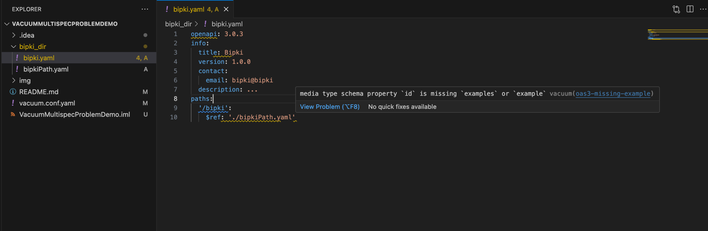
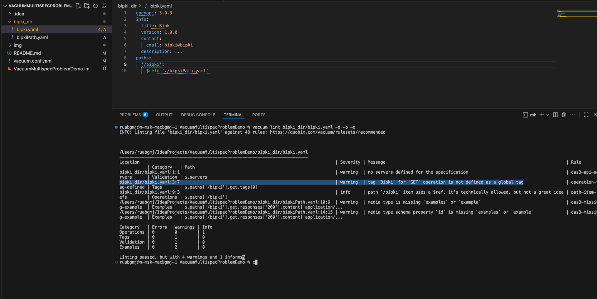

In this repository,
I have prepared a minimal reproducible example showing that
[vacuum language-server](https://quobix.com/vacuum/commands/language-server/) 
does not work well on multiple files

I have the following problem on this branch

It turns out that this problem also exists in the simple lint command

